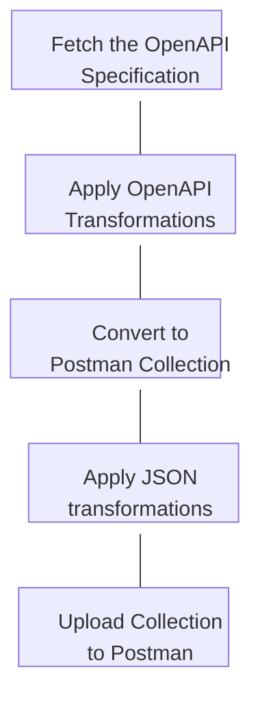

# Postman Collections from OpenAPI

This folder contains the code required to generate the MongoDB Atlas Postman collections from the MongoDB OpenAPI Specification. All scripts can be run locally if the environment variables for POSTMAN_API_KEY, WORKSPACE_ID, BASE_URL, and SLACK_WEBHOOK_URL are set

## Purpose of the project

Scripts allow for the generation of Postman collections from OpenAPI specifications. This allows
the [DevRel Postman workspace](https://www.postman.com/mongodb-devrel) to stay up to date with the latest version of the
API.

1. Fetching OpenAPI file
2. Converting OpenAPI file to Postman Collection
3. Updating information about the Collection
4. Uploading the Collection to Postman

## Postman folder structure

- `openapi` - Where the OpenAPI Spec, version information, and fork files are stored
- `tmp` - Where the Postman Collection is generated and the temporary working files are stored
- `scripts` - Where the Bash scripts are stored
- `validation` - Where the files for spectral validation of the generated collection is stored

## Postman Collection Generation Workflow



1. **Fetch the OpenAPI Specification**: Fetch the most recent version of the OpenAPI file.

2. **Apply OpenAPI transformations**: Apply transformations such as removing regex to prepare openapi file for
   conversion.

3. **Convert to Postman Collection**: Use openapi-to-postmanv2 to convert to a Postman Collection.

4. **Apply JSON transformations**: Apply transformations such as changing title, adding links, adding documentation, and preparing Collection
   for upload.

5. **Upload Collection to Postman**: Use the Postman API to upload the Collection to Postman.

## Local setup and validation

### Prerequisites

To push to your own workspace via Postman API, [create a private workspace](https://learning.postman.com/docs/collaborating-in-postman/using-workspaces/use-workspaces/) and retrieve the workspace id

Then, [create a Postman API Key](https://learning.postman.com/docs/developer/postman-api/authentication/) that has access to this workspace

### Env var setup

To test the scripts locally, you should set up the required environment variables in `tools/postman/scripts` by creating a `local.env` file populated with the following (at the minimum):

```
BASE_URL=""
WORKSPACE_ID=""
POSTMAN_API_KEY=""
```

Run `make load-env` to set your required and overriding env vars.

The OpenAPI path for Postman generation and configured feature flags can also be overriden based on provided env vars.

### Running locally

Once env vars are configured, the setup scripts can be run locally using the Make following commands:
- `make fetch_openapi`
- `make convert_to_collection`
- `make transform_collection`
- `make upload_collection`


### Limitations

Our Postman collection generation has several limitations, meaning some manual user actions may be necessary during setup:

-  Only a single content-type header is supported generation, meaning users may have to manually update this header if the API supports more than one; see docs links on endpoint level
- Only a single auth scheme is supported during generation, meaning users may have to update their auth on the collection level or endpoint level if not selecting the default