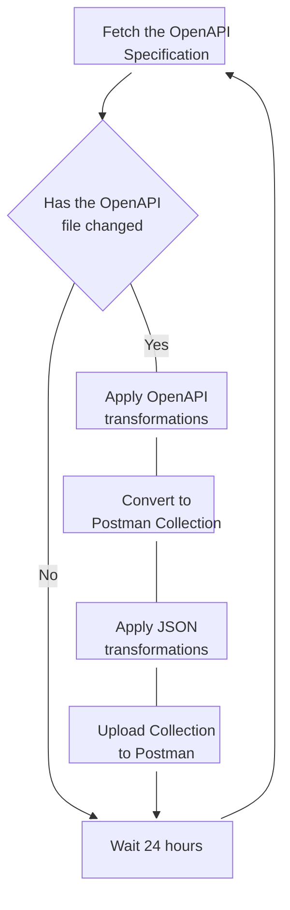

# Postman Collections from OpenAPI

This folder contains the code required to generate the MongoDB Atlas Postman collections from the MongoDB OpenAPI
Specification

## Purpose of the project

Scripts allow for the generation of Postman collections from OpenAPI specifications. This allows
the [DevRel Postman workspace](https://www.postman.com/mongodb-devrel) to stay up to date with the latest version of the
API.

1. Fetching OpenAPI file
2. Converting OpenAPI file to Postman Collection
3. Updating information about the Collection
4. Uploading the Collection to Postman

## Postman folder structure

- `openapi` - Where the OpenAPI and working files are stored
- `scripts` - Where the Bash scripts are stored

## Postman Collection Generation Workflow

1. **Fetch the OpenAPI Specification**: Periodically Fetch for the Changes in the Public OpenAPI file.

2. **Has the OpenAPI file changed**: Checking for that the OpenAPI file has changed stops redundant updates to the
   Collection.

3. **Apply OpenAPI transformations**: Apply transformations such as removing regex to prepare openapi file for
   conversion.

4. **Convert to Postman Collection**: Use openapi-to-postmanv2 to convert to a Postman Collection.

5. **Apply JSON transformations**: Apply transformations such as changing title, adding fields, and preparing Collection
   for upload.

6. **Upload Collection to Postman**: Use the Postman API to upload the Collection to Postman.
